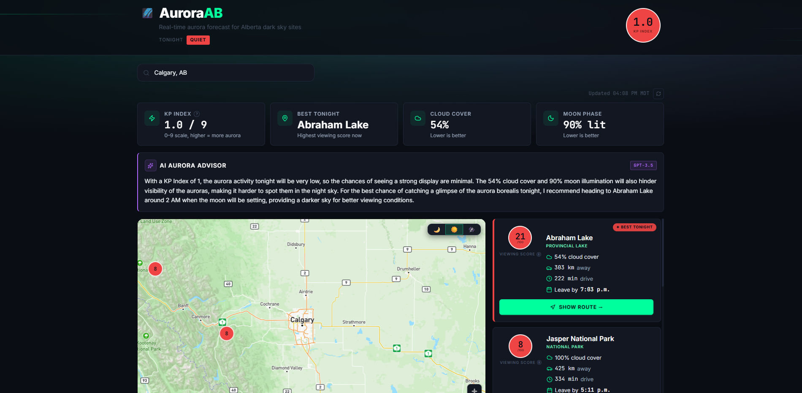
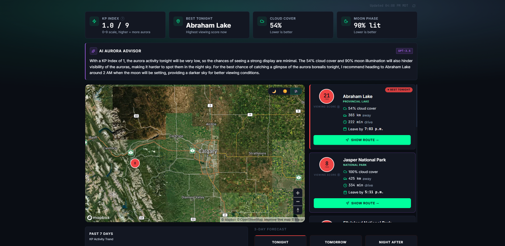
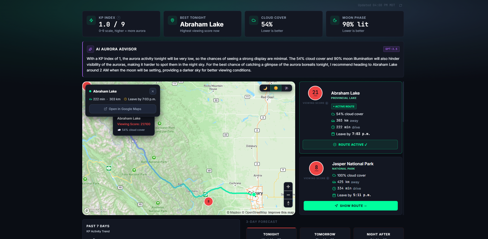
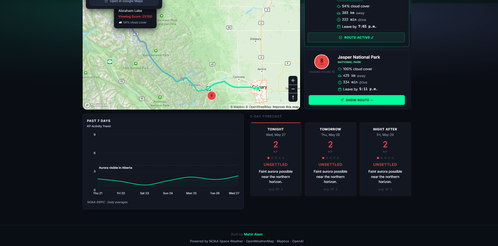

# 🌌 AuroraAB

[](https://github.com/mahir-alam/aurora-ab/actions/workflows/ci.yml)

> Real-time aurora borealis visibility forecasting for Alberta, Canada.

**🔴 [Live Demo](https://aurora-ab.vercel.app)**

Know exactly when and where to see the northern lights in Alberta tonight.

---

## Screenshots

<table>
  <tr>
    <td></td>
    <td></td>
  </tr>
  <tr>
    <td></td>
    <td></td>
  </tr>
</table>

---

## ✨ What It Does

AuroraAB synthesizes 4 independent geophysical data sources into a single viewing recommendation:

- 🛰️ **Live KP index** from NOAA Space Weather satellites
- ☁️ **Real-time cloud cover** at every dark sky location
- 🌙 **Moon phase and illumination** (bright moon hurts visibility)
- 🚗 **Drive time and leave-by calculator** to reach the aurora peak window

It then uses GPT to translate technical space weather data into plain-English advice anyone can follow.

---

## 🎯 Key Features

- **Interactive map** of 7 designated Alberta dark sky locations with viewing scores
- **3 selectable map styles** — Dark, Streets, Satellite
- **In-app route visualization** with aurora gradient line drawing from your location to the chosen aurora spot
- **AI-powered recommendations** using OpenAI GPT-3.5-turbo grounded in real-time data (RAG architecture)
- **Past 7 days KP trend chart** showing recent geomagnetic activity
- **3-day forecast calendar** with intensity meter and plain-English descriptions
- **Drive-time optimization** with Mapbox Directions API
- **Leave-by time calculator** based on aurora peak window (11 PM Mountain Time)
- **Browser geolocation** with Mapbox geocoding fallback
- **Mobile responsive** dark UI

---

## 🛠️ Tech Stack

- **Frontend:** React 18, Vite, Tailwind CSS, Mapbox GL JS, Recharts
- **Backend:** Node.js, Express, MongoDB Atlas
- **APIs:** NOAA SWPC, OpenWeatherMap, Mapbox Directions, OpenAI GPT-3.5-turbo
- **Other:** SunCalc for moon phase calculations
- **Deployment:** Render (backend), Vercel (frontend), GitHub Actions for CI, UptimeRobot for monitoring

## 🧠 AI & GenAI Implementation

This project applies skills from the **IBM Generative AI Engineering Professional Certificate**:

- **Prompt Engineering** — Structured prompts with role assignment, output constraints, and hallucination guards
- **RAG (Retrieval Augmented Generation)** — Live NOAA, weather, and moon data injected into the LLM prompt at runtime so responses are grounded in current reality, not training data
- **AI Application Architecture** — Multi-layer pipeline: data ingestion → synthesis → AI layer → presentation
- **Responsible AI** — Constraint engineering to prevent hallucination and ensure factual responses

---

## 📊 How the Viewing Score Works

Each location gets a 0-100 viewing score calculated from weighted factors:

```
Score = (KP_score × 0.5) + (cloud_score × 0.3) + (moon_score × 0.2)

Where:
  KP_score    = (currentKP / 9) × 100
  cloud_score = 100 - cloudCoverPercent
  moon_score  = 100 - moonIlluminationPercent
```

- **70-100** 🟢 Excellent viewing
- **40-69** 🟡 Moderate viewing
- **0-39** 🔴 Poor viewing

---

## 🌌 Dark Sky Locations

AuroraAB tracks 7 officially designated Alberta dark sky locations:

- Jasper National Park (Canada's largest dark sky preserve)
- Banff National Park
- Abraham Lake
- Elk Island National Park
- Kananaskis Country
- Writing-on-Stone Provincial Park
- Cypress Hills Interprovincial Park

---

## 🚀 Local Development

### Prerequisites
- Node.js 20+
- MongoDB Atlas account
- API keys: OpenWeatherMap, Mapbox, OpenAI

### Backend Setup
```bash
cd server
npm install
npm run dev
```
Create `server/.env` with: `PORT`, `OPENWEATHER_API_KEY`, `MAPBOX_TOKEN`, `OPENAI_API_KEY`, `MONGODB_URI`

### Frontend Setup
```bash
cd client
npm install
npm run dev
```
Create `client/.env` with: `VITE_API_URL`, `VITE_MAPBOX_TOKEN`

Backend runs on `http://localhost:5000`, frontend on `http://localhost:5173`.

---

## 🌐 Live Architecture

```
User → Vercel (React SPA) → Render (Express API) → NOAA SWPC
                                                  → OpenWeatherMap
                                                  → Mapbox Directions
                                                  → MongoDB Atlas
                                                  → OpenAI GPT
```

---

## 👤 Built By

**Mahir Alam** — Computer Science student at University of Calgary

Connect: [LinkedIn](https://linkedin.com/in/mahiralamm) | mahiralam2604@gmail.com

---

## 📜 Data Sources

- [NOAA Space Weather Prediction Center](https://www.swpc.noaa.gov/) — Real-time KP index and geomagnetic forecasts
- [OpenWeatherMap](https://openweathermap.org/) — Cloud cover data
- [Mapbox](https://www.mapbox.com/) — Maps and directions
- [OpenAI](https://openai.com/) — GPT-3.5-turbo for natural language explanations
- [SunCalc](https://github.com/mourner/suncalc) — Moon phase calculations
